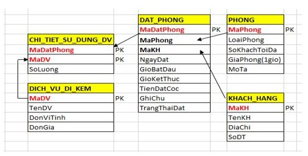
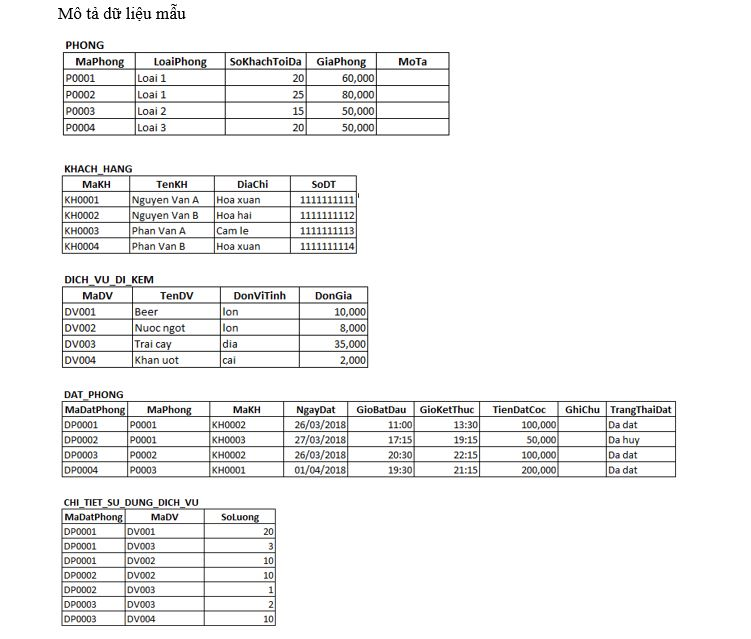

Cho trước thiết kế Database như sau

Yêu cầu học viên thiết kế ra các bảng có cấu trúc như ảnh trên (Lưu ý: Tìm hiểu thêm khái niệm khóa ngoại để hoàn thiện)

Diễn giải:

- KHACH_HANG: lưu trữ thông tin của khách hàng
- PHONG: lưu trữ thông tin phòng karaoke
- DICH_VU_DI_KEM: lưu trữ thông tin các dịch vụ đi kèm được cung cấp tại quán Karaoke.
- DAT_PHONG: lưu trữ thông tin đặt phòng karaoke của khách hàng
- CHI_TIET_SU_DUNG_DV: lưu trữ thông tin chi tiết khi khách hàng sử dụng các dịch vụ đi kèm.
- PK: là các trường tham gia vào khóa chính của bảng

Nhập liệu dữ liệu như hình sau:

Viết câu lệnh SQL để thực hiện các yêu cầu sau (mỗi yêu cầu chỉ được viết tối đa 1 câu lệnh SQL):

1. Liệt kê MaDatPhong, MaDV, SoLuong của tất cả các dịch vụ có số lượng lớn hơn 3 và nhỏ hơn 10

2. Cập nhật dữ liệu trên trường GiaPhong thuộc bảng PHONG tăng lên 10,000 VNĐ so với giá phòng hiện tại, chỉ cập nhật giá phòng của những phòng có số khách tối đa lớn hơn 10.

3. Xóa tất cả những đơn đặt phòng (từ bảng DAT_PHONG) có trạng thái đặt (TrangThaiDat) là “Da huy”.

4. Hiển thị TenKH của những khách hàng có tên bắt đầu là một trong các ký tự “H”, “N”, “M” và có độ dài tối đa là 20 ký tự

Hướng dẫn nộp bài

- Xuất file SQL ở trong GUI Tool (Bao gồm cả cấu trúc và dữ liệu)
- Tạo 1 file SQL tương ứng với 4 câu hỏi trên
